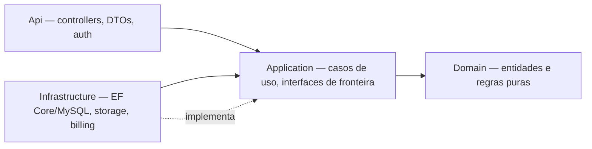

<div align="center">

# 🚗 Carango

**Plataforma de e-commerce de veículos — anuncie, encontre e negocie carros e motos com curadoria de verdade.**

[](https://dotnet.microsoft.com/)
[](https://react.dev/)
[](https://www.typescriptlang.org/)
[](https://www.mysql.com/)
[](https://vite.dev/)
[](#-testes)
[](#-status-do-projeto)

</div>

<!--
  📸 Adicione aqui um print ou GIF da tela de busca/detalhe do Anúncio.
  Exemplo: 
-->

## 📖 Sobre o projeto

Carango é uma plataforma completa de compra e venda de veículos, inspirada em briefs reais de clientes que buscam algo "parecido com o Webmotors" — o brief original que deu origem a este projeto está em [`docs/Projeto.txt`](docs/Projeto.txt).

O projeto foi conduzido como um engajamento de desenvolvimento ponta a ponta: descoberta de requisitos, PRD, arquitetura, design de UX e implementação incremental por epics/stories, com revisão de código adversarial a cada entrega. Toda essa trilha de decisão está documentada em [`_bmad-output/`](_bmad-output).

**Principais papéis do sistema:**

- 👤 **Vendedor (Pessoa Física ou Lojista)** — publica, edita e gerencia seus Anúncios.
- 🔍 **Comprador** — busca, filtra e explora Anúncios sem precisar de conta.
- 🏪 **Lojista** — assina um plano para publicar múltiplos Anúncios ativos simultaneamente e acompanhar métricas.

## 🤖 Como este projeto foi construído

Carango foi desenvolvido de ponta a ponta com o **BMad Method** — um processo estruturado de desenvolvimento assistido por IA que passa por brainstorm → PRD → arquitetura → épicos/histórias → implementação, com **cada história de código passando por revisão adversarial** (múltiplas camadas de revisão procurando ativamente por bugs, edge cases e violações de requisito antes de considerar o trabalho pronto). Os artefatos completos desse processo — PRD, arquitetura, épicos, histórias individuais com decisões documentadas, e retrospectivas por epic — estão versionados em [`_bmad-output/`](_bmad-output).

Não é um projeto "vibe coded": cada decisão de arquitetura — por que Marca/Modelo (Fipe) e Estado/Cidade (IBGE) são tratados de formas diferentes na camada de integração, por que a autorização por posse de um Anúncio vive num único ponto da Application e nunca é duplicada por endpoint, por que o storage de fotos está isolado atrás de uma interface em vez de acoplado a disco local — está documentada e foi uma escolha deliberada, revisitável em [`ARCHITECTURE-SPINE.md`](_bmad-output/planning-artifacts/architecture/architecture-marketplace-veiculos-2026-07-08/ARCHITECTURE-SPINE.md).

## 📑 Índice

- [Como este projeto foi construído](#-como-este-projeto-foi-construído)
- [Funcionalidades](#-funcionalidades)
- [Arquitetura](#-arquitetura)
- [Tecnologias](#-tecnologias)
- [Estrutura do projeto](#-estrutura-do-projeto)
- [Como rodar o projeto](#-como-rodar-o-projeto)
- [Testes](#-testes)
- [Status do projeto](#-status-do-projeto)
- [Decisões técnicas e débito conhecido](#-decisões-técnicas-e-débito-conhecido)
- [Licença](#-licença)
- [Autor](#-autor)

## ✨ Funcionalidades

**Para Vendedores**
- Cadastro e login com autenticação JWT
- Criação de Anúncio com Ficha completa do veículo (marca, modelo, ano, versão, preço, descrição, estado, cidade) e fotos
- Marca/Modelo escolhidos a partir da tabela Fipe (não é mais texto livre)
- Estado/Cidade escolhidos a partir da lista oficial do IBGE, em cascata
- Edição, pausa, reativação, exclusão e gestão de fotos de um Anúncio já publicado
- Painel "Meus Anúncios" com status de cada publicação

**Para Compradores**
- Busca com múltiplos filtros (marca, modelo, ano, versão, faixa de preço, estado, cidade) e busca textual livre
- Ordenação por preço, ano ou relevância, com paginação incremental ("carregar mais")
- Página de detalhe do Anúncio com galeria de fotos e contador de visualizações

**Monetização (Lojista)**
- Destacar um Anúncio como patrocinado (prioridade nos resultados de busca)
- Assinatura de Plano Lojista — remove o limite de 1 Anúncio ativo por vendedor Pessoa Física
- Painel do Lojista com métricas por Anúncio (visualizações, status da assinatura)

## 🏗️ Arquitetura

O backend segue **Clean Architecture** com direção de dependência fixa (o frontend React nunca acessa o banco ou lógica de negócio diretamente — é só um cliente HTTP da API):



Decisões arquiteturais relevantes (documentadas por completo em [`ARCHITECTURE-SPINE.md`](_bmad-output/planning-artifacts/architecture/architecture-marketplace-veiculos-2026-07-08/ARCHITECTURE-SPINE.md)):

- **API-first** — nenhuma regra de negócio no cliente; o servidor é sempre a fonte de verdade.
- **Fronteiras isoladas atrás de interfaces** (`IMediaStorage`, `IBillingGateway`, `IVeiculoReferenciaGateway`) — trocar o provedor de storage de fotos, o gateway de pagamento ou a fonte de dados da Fipe não exige reescrever regra de negócio.
- **Autorização por posse** centralizada num único ponto da camada Application, nunca duplicada por endpoint.
- **Nomenclatura de domínio em português** (`Anuncio`, `Vendedor`, `PlanoLojista`) espelhando o glossário do PRD em todas as camadas — só termos técnicos genéricos (`Controller`, `Repository`) seguem convenção em inglês.

## 🛠️ Tecnologias

| Camada | Stack |
| --- | --- |
| **Backend** | .NET 10 / ASP.NET Core · Entity Framework Core 9 · Pomelo.EntityFrameworkCore.MySql · JWT Bearer Auth |
| **Banco de dados** | MySQL 8.4 |
| **Frontend** | React 19 · TypeScript · Vite 8 |
| **Testes** | xUnit v3 · Shouldly · `Microsoft.AspNetCore.Mvc.Testing` (testes de integração via `WebApplicationFactory`) |
| **Integrações externas** | API pública da Fipe (marca/modelo) · dataset estático do IBGE (estado/cidade) |

## 📂 Estrutura do projeto

```text
Carango/
├── backend/
│   ├── Domain/           # Entidades e regras de negócio puras (Anuncio, Vendedor, PlanoLojista...)
│   ├── Application/      # Casos de uso e interfaces de fronteira (IMediaStorage, IBillingGateway...)
│   ├── Infrastructure/   # EF Core/MySQL, storage local, JWT, gateway da Fipe
│   ├── Api/              # Controllers, DTOs, autenticação — ponto de entrada HTTP
│   └── Tests/            # Testes de unidade e integração (xUnit)
├── frontend/
│   └── src/
│       ├── features/     # Telas por domínio (autenticação, anúncios, busca)
│       └── shared/       # Componentes e clientes de API reaproveitados entre features
└── _bmad-output/         # PRD, arquitetura, epics/stories e histórico de decisões do projeto
```

## 🚀 Como rodar o projeto

### Pré-requisitos

- [.NET SDK 10.0](https://dotnet.microsoft.com/download)
- [Node.js ≥ 20.19 ou ≥ 22.12](https://nodejs.org/) (exigido pelo Vite 8)
- [MySQL 8.4](https://dev.mysql.com/downloads/mysql/) rodando localmente (ou em container)
- Ferramenta `dotnet-ef` instalada globalmente: `dotnet tool install --global dotnet-ef`

### 1. Clonar o repositório

```bash
git clone <url-do-seu-repositorio>
cd Carango
```

### 2. Banco de dados

Crie um banco vazio chamado `carango` no seu servidor MySQL:

```sql
CREATE DATABASE carango CHARACTER SET utf8mb4;
```

### 3. Configurar variáveis de ambiente do backend

O projeto nunca lê segredos de `appsettings.json` — a connection string e a chave JWT vêm sempre de variáveis de ambiente (12-factor):

```bash
# Windows (PowerShell)
$env:ConnectionStrings__Default = "Server=127.0.0.1;Port=3306;Database=carango;User=root;Password=SUA_SENHA;"
$env:Jwt__SigningKey = "uma-chave-com-pelo-menos-32-caracteres-aqui"

# Linux / macOS
export ConnectionStrings__Default="Server=127.0.0.1;Port=3306;Database=carango;User=root;Password=SUA_SENHA;"
export Jwt__SigningKey="uma-chave-com-pelo-menos-32-caracteres-aqui"
```

> A `Jwt:SigningKey` precisa ter no mínimo 32 caracteres (HMAC-SHA256 exige 256 bits) — o backend recusa iniciar com uma chave menor, com uma mensagem explicando o que configurar.

### 4. Rodar as migrations e subir o backend

```bash
cd backend/Api
dotnet ef database update
dotnet run --launch-profile https
```

A API sobe em `https://localhost:7090`.

### 5. Rodar o frontend

Em outro terminal:

```bash
cd frontend
npm install
npm run dev
```

O frontend sobe em `http://localhost:5173` e já tem proxy configurado (`vite.config.ts`) para `/api` e `/uploads` apontando pra API em `https://localhost:7090` — não precisa configurar CORS nem variável de ambiente adicional.

## ✅ Testes

```bash
cd backend/Tests/Carango.Tests
dotnet test
```

307 testes (unidade + integração) cobrindo Domain, Application e Api. O frontend ainda não tem suíte de testes automatizados — ver [Decisões técnicas e débito conhecido](#-decisões-técnicas-e-débito-conhecido).

## 📊 Status do projeto

Desenvolvimento conduzido por epics/stories, com retrospectiva ao final de cada epic:

| Epic | Status | Stories concluídas |
| --- | --- | --- |
| 1 — Autenticação e Perfis | Em andamento | 3/4 (login social bloqueado por credenciais OAuth reais) |
| 2 — Gestão de Anúncios | ✅ Concluído | 8/8 |
| 3 — Busca e Descoberta | Em andamento | 7/8 (contato Comprador-Vendedor bloqueado por decisão de negócio em aberto) |
| 4 — Monetização e Painel do Lojista | ✅ Concluído | 5/5 |

23 stories entregues no total. Os 2 itens em backlog estão bloqueados por decisões externas ao time de desenvolvimento (credenciais de OAuth reais e definição do canal de contato com o vendedor), não por falta de implementação.

## 🧭 Decisões técnicas e débito conhecido

Documentar o que ainda não está pronto é parte da arquitetura deste projeto, não um esconderijo de problema:

- **Storage de fotos em disco local** — implementação interina (`IMediaStorage`/`LocalDiskMediaStorage`) enquanto um provedor definitivo (S3, Azure Blob, MinIO) não é escolhido. A interface já isola essa troca sem tocar em Domain/Application.
- **Gateway de pagamento mockado** — `MockBillingGateway` sempre aprova a cobrança; a integração real depende de o cliente escolher o gateway (Stripe, Mercado Pago, PagSeguro etc.).
- **Sem testes automatizados de frontend** — cobertura de UI hoje é build limpo (`tsc`/`vite build`) + revisão de código; Vitest/Testing Library é um item em aberto.
- **Corrida de concorrência (lost-update)** em fluxos de check-then-mutate-then-persist (destacar Anúncio, assinar plano) — sem token de concorrência otimista ainda; mapeado como ação de arquitetura para antes de qualquer integração de cobrança real.
- **Sem infraestrutura de logging estruturado** no backend.

## 📄 Licença

Todos os direitos reservados. Este repositório é disponibilizado publicamente como parte de portfólio — uso, cópia ou redistribuição do código requer autorização prévia do autor.

## 👤 Autor

**Mauricio Mayer**

- GitHub: [@mauriciomayer](https://github.com/mauriciomayer)
- LinkedIn: [mauricio-mayer-soares](https://www.linkedin.com/in/mauricio-mayer-soares/)
- E-mail: [mauricio.mayer@gmail.com](mailto:mauricio.mayer@gmail.com)
